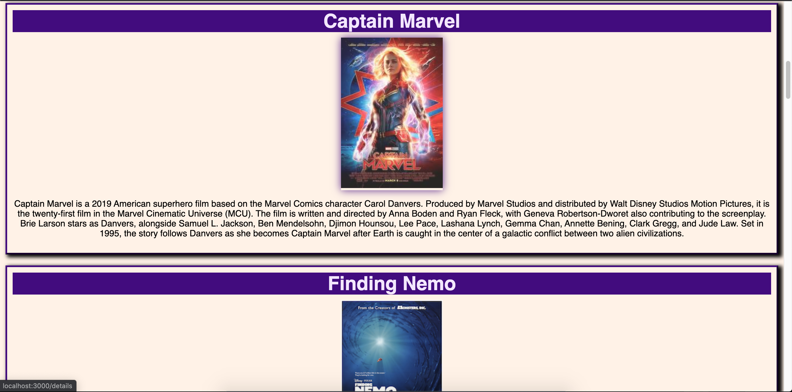
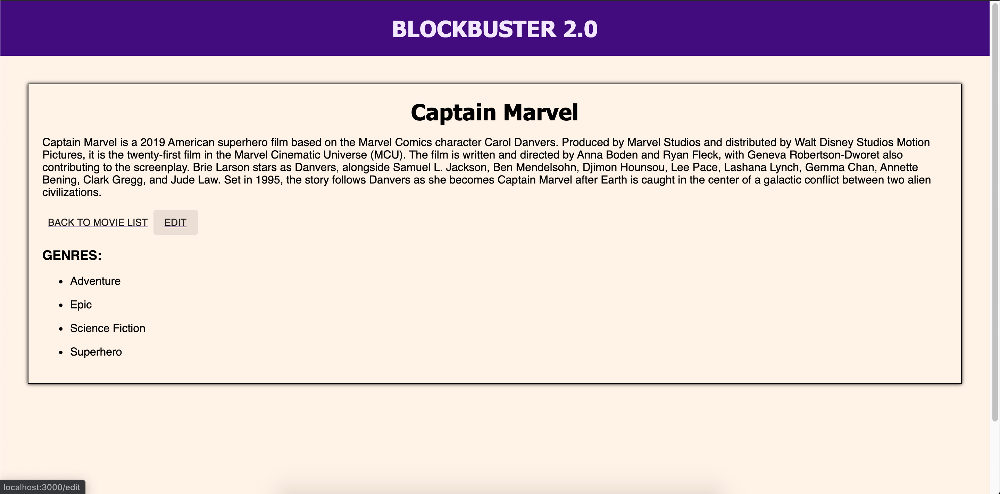
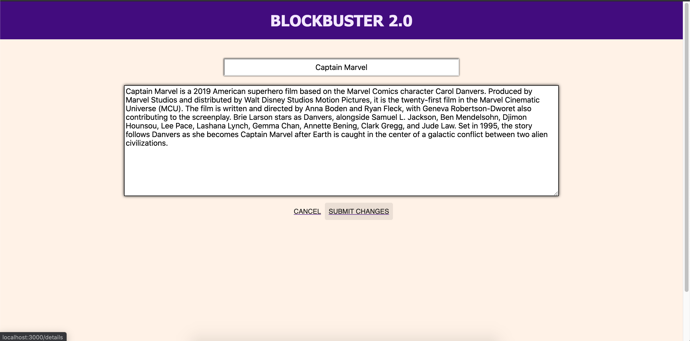

# Movie Sagas Project: Blockbuster 2.0 Editor!

## Description
Duration: ~15 hours

This project allows a user to select a movie from our database we have, clicking the poster will route the user to another details page, also displaying genres at the details page. The details page has the ability to go back to the previous movies list, or edit the current movie. The edit button routes the user to the Edit page and can then change the title or description by submitting and will submit the new information to the database. Otherwise you can cancel bringing you back to the Details page. 

During this project I had to correctly set up my GET routers and PUT router, set up and understand reducers and generators with Redux-Saga. Using BrowserRouter to route, using connect to access our reduxState and display information on each page. To display I had to dispatch and correctly map throughout our arrays of information to display the correct movie.

## Screen Shots






## Prerequisites

* [Node.js](https://nodejs.org/en/)

* [PostgreSQL](https://www.postgresql.org/)

* [Nodemon](https://nodemon.io/)

## Installation

1.) Create a database named ```saga_movies_weekend``` and enter the data from the [database.sql](https://github.com/mshaokee/Movies-Saga-Project/blob/master/database.sql) file

2.) Open your source code editor and run ```npm install```

3.) Run ```npm run server``` in your terminal

4.) Run ```npm run client``` in your terminal to open a new browser to view the application

## Usage

1.) You can browse the different movies then click on them to see their description data.

2.) You can edit the specific movies by clicking the edit button and then submitting changes.

## Technologies Used
* Javascript
* Node.js
* React / Redux / Saga
* CSS
* Axios
* Material UI

## Acknowledgement
Thanks to Prime Digital Academy and my cohort Lamport for their support and guidance. 
